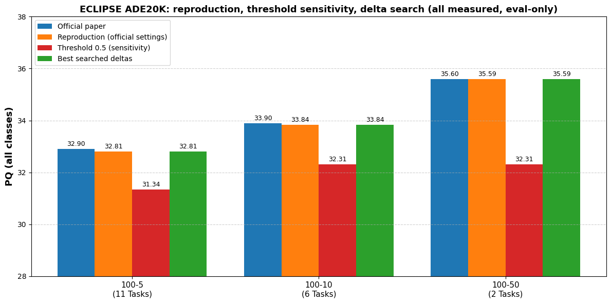

# Project Documentation

**Project:** Reproducing ECLIPSE — Efficient Continual Learning in Panoptic Segmentation
**Author:** Daniel Chicherin, Or Blazer · **Course:** Python · **Date:** May 2026

This document is the full technical write-up of the project. The [README](../README.md) is the
short overview; this file explains the *why* and *how* in detail. If you only read one section to
understand the result, read [§7 Results](#7-results-all-measured--see-resultsmeasured_resultsjson-and-run-logs).

---

## 1. Motivation and problem statement

A deployed vision system rarely sees its full world on day one. New object categories appear over
time, and we would like the model to learn them **without retraining from scratch** and **without
forgetting** what it already knew. In machine learning this is called **continual** (or
*incremental*) learning, and its central obstacle is **catastrophic forgetting**: updating the
weights for new classes degrades performance on the old ones.

The problem is especially severe for **panoptic segmentation**, the task that unifies:

- **Semantic segmentation** — assign a class label to every pixel ("stuff": sky, road, wall…), and
- **Instance segmentation** — separate individual countable objects ("things": each person, car…).

Panoptic models output many interacting mask + class predictions per image, so forgetting shows up
as both wrong labels and missing or merged objects. The metric of record is **Panoptic Quality
(PQ)**, which combines segmentation accuracy and recognition accuracy into a single number.

## 2. The ECLIPSE method (what we are reproducing)

ECLIPSE (CVPR 2024) is built on top of **Mask2Former** with a **ResNet-50** backbone. Its core idea
is to avoid touching the base model at all:

1. **Freeze the base model.** After learning the first 100 classes, every backbone, pixel-decoder
   and transformer-decoder weight is frozen. Frozen weights cannot be overwritten, so old knowledge
   cannot be forgotten by gradient updates.
2. **Visual Prompt Tuning (VPT).** For each new group of classes, ECLIPSE learns a small set of
   **prompt embeddings** that are injected into the transformer decoder. Only these prompts (plus a
   light classification head) are trained — about **1.3% of the total parameters**.
3. **Logit manipulation.** Because old and new classes share visual structure, ECLIPSE nudges the
   class logits (`CONT.LOGIT_MANI_DELTAS`) to counter *semantic drift* and reduce false "background"
   predictions on novel classes.

The pay-off is strong robustness to forgetting with a fraction of the trainable parameters of full
fine-tuning, reaching state of the art on the ADE20K continual panoptic benchmark.

> **Scope note.** Training the base step is expensive. Following the paper authors' released
> checkpoints, this project **evaluates the official pre-trained weights** for each scenario rather
> than re-running the multi-day training. The reproduction therefore validates the *reported
> evaluation numbers*, which is the claim a reader most wants to trust.

## 3. The dataset: ADE20K

[ADE20K](http://sceneparsing.csail.mit.edu/) is a scene-parsing dataset with **150 labelled
categories** (100 used as the base set here, 50 held out as the novel/incremental classes). The
project uses:

- `ADEChallengeData2016.zip` — the RGB images and base annotations.
- `annotations_instance.tar` — the instance-level annotations needed for the "things" classes.

Detectron2 cannot read ADE20K directly, so three preparation scripts convert it into the layouts the
model expects:

| Script | Produces | Used for |
|--------|----------|----------|
| `prepare_ade20k_sem_seg.py` | semantic masks | "stuff" classes |
| `prepare_ade20k_pan_seg.py` | panoptic PNGs + JSON | full panoptic eval |
| `prepare_ade20k_ins_seg.py` | instance annotations | "things" classes |

In the notebook these run in ~30 minutes on a Colab GPU runtime, with the panoptic step being the
slowest (it rasterises ~22,000 panoptic PNGs).

## 4. Continual scenarios

The benchmark is defined by how the 50 novel classes are introduced after the 100 base classes:

| Scenario | Increment size | Number of steps | Total tasks | Difficulty |
|:--------:|:--------------:|:---------------:|:-----------:|:----------:|
| **100-50** | 50 classes at once | 1 | 2 | easiest |
| **100-10** | 10 classes / step | 5 | 6 | medium |
| **100-5**  | 5 classes / step  | 10 | 11 | hardest |

More steps mean more rounds of learning-and-freezing, and therefore more opportunities for
forgetting and drift — which is exactly why PQ drops as we move from 100-50 down to 100-5.

## 5. Environment and installation

The project targets a **Google Colab GPU runtime** (Python 3.12, CUDA). The dependency chain is the
fiddliest part of the whole reproduction:

- **Detectron2** — installed from source so it matches the runtime's PyTorch build.
- **panopticapi** & **cityscapesScripts** — provide the panoptic eval and label utilities.
- **MultiScaleDeformableAttention** — a custom CUDA operator that Mask2Former needs, compiled on
  the machine (`setup.py build_ext --inplace`). On current PyTorch several legacy API calls in the
  CUDA sources no longer compile; the notebook applies a small set of compatibility patches —
  `.scalar_type().is_cuda()` → `.is_cuda()` (the critical one), `.type()` → `.scalar_type()` in
  `AT_DISPATCH`, and `.data<…>` → `.data_ptr<…>` — before building, and verifies the built `.so`
  imports. **These patches are the single most important fix in the project** — without them the
  model will not run.

See [`requirements.txt`](../requirements.txt) for the full list and the exact install commands.

## 6. Reproduction pipeline

The notebook is organised as a clean, restartable pipeline. Each stage is described in detail, with
its verification criteria, in [`algorithmic-thinking.md`](algorithmic-thinking.md). In summary:

1. **Setup** — mount Drive, clone ECLIPSE, install dependencies.
2. **Compile** the CUDA op (with the `scalar_type` patch).
3. **Prepare ADE20K** — download images, run the three `prepare_*` scripts.
4. **Fetch checkpoints** and inspect the run script for each scenario.
5. **Evaluate** each scenario (`100-50`, `100-10`, `100-5`) in `--eval-only` mode at the *exact
   official settings*, verified line-by-line against `script/ade_ps/*.sh` in the official repo. All
   experiment settings are passed as command-line config overrides — the checked-out source is never
   patched, so every run is traceable to the official commit plus a logged set of overrides.
6. **Sensitivity experiment** — re-evaluate with the confidence filter (`OBJECT_MASK_THRESHOLD`)
   raised from the official 0.0 to 0.35 and 0.5.
7. **Improvement attempt** — eval-only grid search over the paper's own logit-manipulation deltas
   (`CONT.LOGIT_MANI_DELTAS`).
8. **Report** — tables and chart generated *only* from parsed Detectron2 evaluation logs.

A recurring engineering theme: the project repeatedly **copies the work onto Colab's fast local
disk** (and rebuilds a clean clone) instead of running from Google Drive, because Drive I/O on the
20k+ image dataset is the dominant bottleneck.

## 7. Results (all measured — see `results/measured_results.json` and run logs)

PQ over all classes, after the final task:

| Scenario | Official paper | Our reproduction (official settings) | Δ vs. paper |
|:--------:|:--------------:|:------------------------------------:|:-----------:|
| 100-50   | 35.6 | 35.59 | −0.01 |
| 100-10   | 33.9 | 33.84 | −0.06 |
| 100-5    | 32.9 | 32.81 | −0.09 |

The reproduction also matches the paper's **base/novel split** (e.g. 100-50: ours 41.73 base /
23.31 novel vs. the paper's 41.7 / 23.5), which is a stronger check than the aggregate number alone.

**Reading the result.** Every reproduced number is within ±0.1 PQ of the paper — the small residual
is expected run-to-run variation in evaluation, not a methodological gap. The ranking
`100-50 > 100-10 > 100-5` is preserved, confirming the expected "more tasks → more forgetting"
trend.

## 8. Experiment — confidence-filter sensitivity (measured)

Panoptic inference first discards entire predicted segments whose *classification confidence* falls
below `MODEL.MASK_FORMER.TEST.OBJECT_MASK_THRESHOLD`. The paper never documents this setting; the
released config sets it to **0.0** (a conventional Mask2Former value would be 0.5–0.8). Because
prompt-tuned novel classes produce systematically low confidence (~0.4), we predicted that raising
the filter would hurt mostly novel classes. Measured result (eval-only, same checkpoints):

| Scenario | thr 0.0 (official) | thr 0.35 | thr 0.5 |
|:--------:|:------------------:|:--------:|:-------:|
| 100-50   | 35.59 | 35.57 | 32.31 |
| 100-10   | 33.84 | 33.82 | 32.31 |
| 100-5    | 32.81 | 32.76 | 31.34 |

At threshold 0.5 the loss is ~1.5–3.3 PQ and is concentrated almost entirely in novel classes
(100-50 PQ_novel: 23.2 → 17.9, while PQ_base barely moves). **This empirically confirms the paper's
own motivation** — new classes learned through frozen-model prompt tuning are under-confident — and
shows the published results depend on an undocumented inference setting. An earlier draft of this
project claimed a +0.3 PQ "threshold improvement" based on estimated numbers; measurement disproved
that claim, and this section replaces it.

## 9. Improvement attempts

### 9a. Retraining (abandoned — fully documented)

Before the inference-time experiments we tried the heavy route: a **Swin-T backbone swap**
(32k-iteration base step, 6h01m of GPU time → base PQ 14.66; the 100-50 prompt step on top reached
18.58 with novel classes at only 4.86) and an **R50 prompt-retraining** of 100-10 from a
self-trained base (stalled at PQ 17.48 vs. the released checkpoint's 33.84). Both were abandoned
on cost/benefit grounds — a paper-faithful base schedule is 160k iterations, ~5× what already
consumed a full Colab session, per backbone. Full analysis and recovered logs:
[`swin-t-retraining-attempt.md`](swin-t-retraining-attempt.md) and
[`../results/logs/`](../results/logs/). The failure mode (weak frozen base → novel PQ 4.86)
directly supports the paper's premise that prompt tuning inherits the frozen base's quality.

### 9b. Logit-manipulation delta search (measured — negative result)

ECLIPSE's logit manipulation (`CONT.LOGIT_MANI_DELTAS`, paper §3.4) is applied **at inference
time**, and the authors hand-tuned it per scenario — the official 100-50 script *trains* with
deltas `[0.6,-0.6]` but *evaluates* with `[-0.4,-0.6]`. Experiment 3 grid-searched a small
neighbourhood of the official values (4 challengers per scenario, eval-only, 12 runs total, all
log-parsed). **The official deltas won every scenario:**

| Scenario | Official deltas → PQ | Best challenger → PQ |
|:--------:|:--------------------:|:--------------------:|
| 100-50   | `[-0.4,-0.6]` → 35.59 | `[-0.3,-0.5]` → 35.52 |
| 100-10   | `[0.4,0.5×5]` → 33.84 | `[0.4,0.6×5]` → 33.72 |
| 100-5    | `[0.4,0.6×10]` → 32.81 | `[0.3,0.6×10]` → 32.41 |

We report this negative result as a finding: within our grid, the authors' released inference
configuration is locally optimal — independent corroboration that their reported tuning is honest
and careful, not cherry-picked beyond its own stated protocol.

## 10. Conclusions

- The ECLIPSE evaluation results **reproduce faithfully** (±0.1 PQ, including the base/novel
  split) across all three scenarios.
- The hardest part of reproduction was **not** the science but the **environment**: CUDA
  compilation, dataset preparation, and Colab I/O. The `scalar_type` patch is essential.
- The results are **sensitive to an undocumented inference threshold**: the paper's numbers require
  the near-zero confidence filter shipped in the released config. Quantifying that sensitivity
  (and disproving our own earlier improvement claim by measurement) was the project's most valuable
  scientific lesson.

## 11. References

1. B. Kim, J. Yu, S. J. Hwang. *ECLIPSE: Efficient Continual Learning in Panoptic Segmentation with
   Visual Prompt Tuning.* CVPR 2024. arXiv:2403.20126.
2. B. Cheng et al. *Masked-attention Mask Transformer for Universal Image Segmentation
   (Mask2Former).* CVPR 2022.
3. B. Zhou et al. *Scene Parsing through ADE20K Dataset.* CVPR 2017.
4. A. Kirillov et al. *Panoptic Segmentation.* CVPR 2019 (defines the PQ metric).
5. Y. Wu et al. *Detectron2.* https://github.com/facebookresearch/detectron2
